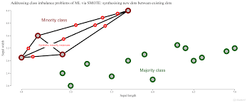

# Remedies for imbalanced sample 

## different strategies : 
- Special-purpose learning method : Modifications of the learning algorithm
    - advantages : 
        - users goals are incorporated directly into the models 
        - model obtained more comprehensive for the users
    - disadvantages : 
        - user is restricted in his algorithmm choices or have to developp new algorithm
        - if the target of the loss function changes, model must be relearned
        - requires deep knowlegde of the learning algorithm implementation
- Data Pre-processing : changes on the data before the learning process takes place
    - advantages:
        - can be applied to any existing tools 
        - choosen models are biased to the goals of the users 
    - inconevnient:
        - difficult to relate modification of the data wit the loss function
    - methods :
         - weighting data spaces
         - re sampling
         - active learning
- Prediction Post-processing : transformations applied to the predictions of the learned model
    - advantages :
        - not necessary to know user preference biases at learning time
        - any standard learning tool can be used
    - drawbavks : 
        - models do not reflect user preferences
        - models interpretability is meaningless because loss function was not optimized following user preference bias
    - methods : 
        - threeshold methods
        - cost sensitive
- Hybrid solutions

## Model tuning 
> The simplest approach to counteracting the negative effects of class imbalance is to tune the model to maximize the accuracy of the minority class(es).

Exactly the same for my works on spotify, not enouhgh high 
> Given that the increase in sensitivity is not high enough to be considered acceptable

## Alternate Cutoffs

Not efficient in my spotify works

> When there are two possible outcome categories, another method for increasing the prediction accuracy of the minority class samples is to determine alternative cutoffs for the predicted probabilities

Not a real solution for our issue because it changes our definition classes 

> which effectively changes the definition of a predicted event. 

Unless we do it with care / i don't think it is a good solution

> There may be situations where the sensitivity/specificity trade-off can be accomplished without severely compromising the accuracy of the majority class (which, of course, depends on the context of the problem)

Interesting if : 

- focus on a compromise beetween sensityvioty and specificity.
> particular target that must be met for the sensitivity or specificity,
- we want to maximise accuracy.
> Find the point on the ROC curve that is closest (i.e., the shortest distance) to the perfect model (with 100 % sensitivity and 100 % specificity)
- use of Youden's J index ???
> (see Sect. 11.2), which measures the proportion of correctly predicted samples

## Adjusting Prior probabilities 

Weiss and Provost (2001a) suggest that priors that reflect the natural class imbalance will materially bias predictions to the majority class. Using more balanced priors or a balanced training set may help deal with a class imbalance.

Many interrogations about it ???

> Unless specified manually, these models typically derive the value of the priors from the training data.

> Using more balanced priors or a balanced training set may help deal with a class imbalance.

> For the insurance data, the priors are 6 % and 94 % for the insured and uninsured, respectively.

> For example, new priors of 60 % for the insured and 40 % for the uninsured in the FDA model increase the probability of having insurance significantly.

## Unequal Case Weights / Weighting the data spaces :

The strategy of weighting the data space is a way of implementing cost sensitive learning. In fact, misclassification costs are applied to the given data set with the goal of selecting the best training distribution

this method is based on the fact that changing the original sampling distribution by multiplying each case by a factor that is proportional to its importance (relative cost)

For many predictive models of classification, this technic is possible. 

> One approach to rebalancing the training set would be to increase the weights for the samples in the minority classes (Ting 2002). 

To illustrate : (seems to be close to oversampling)

>  can be interpreted as having identical duplicate data points with the exact same predictor values

## Cost sensitive Trainig: include cost into during the learning process !!!!!!!!

Le concept de coût est un concept général qui aide à la décision dans toutes les solutions proposées (pre, during and post). Ici on l'intègre pendant la phasse d'apprentissage !!!!!!!

The incorporation of benefits and/or costs (negative benefits) in existing algorithms, as a way to express the utility of different predictions, is one of the known approaches to cope with imbalanced domains.

Regarding support vector machines severa ways of integrating costs have been considered such as assigning different
penalties to false negatives and positives (Akbani et al., 2004) or including a weighted attribute strategy (Yuanhong et al., 2009) 

Ensembles have also been considered in the cost-sensitive framework to handle imbalanced domains
ADABOOST is the more commun ... When the class distribution is imbalanced, AdaBoost biases the learning (through the weights) towards the majority class, as it contributes more to the overall accuracy

Ensembles autres : SVMs

Definition:

> Instead of optimizing the typical performance measure, such as accuracy or impurity, some models can alternatively optimize a cost or loss function that differentially weights specific types of errors.

Example : 

>  misclassifying true events (false negatives) is X times as costly as incorrectly predicting nonevents (false positives).

## Re Sampling Methods

Very similar than case weights

- With a priori knowledge of a class imbalance (?): 

>  to select a training set sample to have roughly equal event rates during the initial data collection.

>  we can attempt to balance the class frequencies.

- Post hoc approaches : down sampling and over sampling the data

> Up-sampling is any technique that simulates or imputes additional data points to improve balance across classes

> Down-sampling refers to any technique that reduces the number of samples to improve the balance across classes

Example of upsampling : Ling and Lee (1998) -> adding random sample to the minority class

> Ling and Li (1998) provide one approach to up-sampling in which cases from the minority classes are sampled with replacement until each class has approximately the same number. 

### Over and under sampling methods

- random OS and US 
    - For US : 
        - distance criteria that determines which are the examples from majority class to include in the training set 
        - data cleaning methods : identify possible noisy 
        - Recognotion based method (one class learning too ) : learn with only examples from the target class
        - one class learning 
    - For OS : 
        - Cluster based oversampling 

### ROSE : Randomly Over Sampling Examples 

Creates a sample of synthetic  data by enlarging the features space of minority and majority class examples. Operationally, the new examples are down from a conditionnal kernel density estimate of the two classes as describe in Menardi and torelli (2013)

### SMOTE - Supersampling Rare Events in R : (Chawla et al. 2002)

The SMOTE function oversamples your rare event by using bootstrapping and k-nearest neighbor to synthetically create additional observations of that event. The definition of rare event is usually attributed to any outcome/dependent/target/response variable that happens less than 15% of the time. For more details about this algorithm, read the original white paper, SMOTE: Synthetic Minority Over-sampling Technique, from its creators.

- references
    - Chawla, N. V., Bowyer, K. W., Hall, L. O., and Kegelmeyer, W. P. (2002). Smote: Synthetic minority over-sampling technique. Journal of Artificial Intelligence Research, 16:321-357.
    - Torgo, L. (2010) Data Mining using R: learning with case studies, CRC Press (ISBN: 9781439810187).

!!!! a lot of new techniques directly derived from this one as ADASYN

# Active learning :

The active learning strategy provides the ability of actively selecting the best , i.e the most informative, examples to learn from. 

VIRTUAL combines benefits of active learning and over sampling
