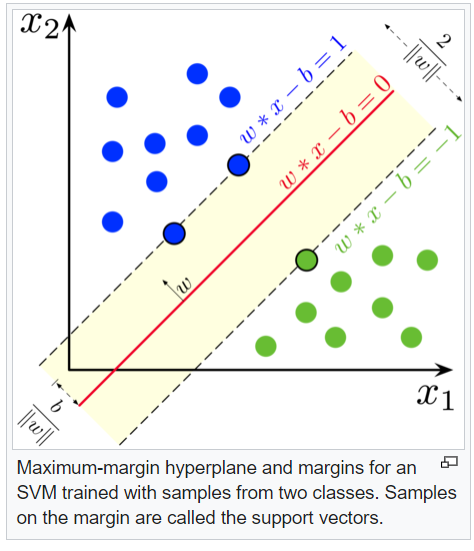

# Classifiers 

## LDA

## Presentation

The Linear Discriminant analysis classifier is used to predict the probability of belonging to a given class based on one or multiple predictor variables. It works with continuous and/or categorical predictor variables.

Linear discriminant analysis is a generalization of Fisher's linear discriminant, a method used in statistics to find a linear combination of features that characterizes or separates two or more classes of objects.

In this approach, Fishers sought to find the linear combination of the predictors such that the between-group variance was maximized relative to the within-group variance. In other words, he wanted to find the combination of the predictors that gave maximum separation between the centers of the data while at the same time minimizing the variation within each group of data. [@lda]

### Learning LDA model

$\mu_k$ and $\sigma_k$ the mean and variance for the k-class.
LDA makes predictions by estimating the probability that a new set of inputs belongs to each class. 
LDA makes some simplifiying assumptions about your data: 
* that your data are gaussian
* that each distribute the same variance, so $\sigma_0 = \sigma_1 = \sigma$
The model uses Bayes Theorem to estimate the probabilities.
$$P(Y=c|X=x) = \frac{\pi_c f_c(x)}{\sum_{j=1}^k \pi_j f_j(x)}$$
Where $\pi_c$ refers to the base probability of each class (c) observed in your training data. In Bayes’ Theorem this is called the prior probability.
$$\pi_c=\frac{n_c}{n}$$
Estimation of $f_c$ is more delicate, it is the estimated probability of $x$ belonging to the class. A Gaussian distribution function is used for $f_c$. Plugging the Gaussian into the above equation and simplifying we end up with the equation below. This is called a discriminate function and the class is calculated as having the largest value will be the output classification :

x will be affected to the class c for which:
$$\hat\delta_c(x) = \ln \hat\pi_c - \frac{\hat\mu_c^2}{2\hat\sigma^2} + x\frac{\hat\mu_c}{\hat\sigma^2}$$ is maximum.

$\hat\delta_c(x)$ is the discriminate function for class c given input x, the $mu_k$, $sigma^2$ and $\pi_c$ are all estimated from your data.

## logistic regression

In statistics, the logistic model (or logit model) is used to model the probability of a certain class. Each object being detected in the image would be assigned a probability between 0 and 1, with a sum of one. Logistic regression is a statistical model that in  uses a logistic function to model a binary dependent variable. In regression analysis, logistic regression is estimating the parameters of a logistic model.

Binary Logistic Regression Major Assumptions:
* The dependent variable should be dichotomous in nature.
* There should be no outliers in the data, which can be assessed by converting the continuous predictors to standardized scores
* There should be no high correlations (multicollinearity) among the predictors.  This can be assessed by a correlation matrix among the predictors. Tabachnick and Fidell suggest that as long correlation coefficients among independent variables are less than 0.90 the assumption is met [@log].

At the center of the logistic regression analysis is the task estimating the log odds of an event.  Mathematically, logistic regression estimates a multiple linear regression function defined as:

$$logit(p)= \log \frac{p(y=1)}{1-p(y=1)}= \beta_0 + \beta_1x_1 + \beta_2x_2 + ... + \beta_ix_i$$

Overfitting.  When selecting the model for the logistic regression analysis, another important consideration is the model fit.  Adding independent variables to a logistic regression model will always increase the amount of variance explained in the log odds (typically expressed as $R^2$).  However, adding more and more variables to the model can result in overfitting, which reduces the generalizability of the model beyond the data on which the model is fit.

## SVM 

Support vector machine try to make a reasonable choice as the best hyperplane is the one that represents the largest separation, or margin, between the two classes. So we choose the hyperplane so that the distance from it to the nearest data point on each side is maximized. If such a hyperplane exists, it is known as the maximum-margin hyperplane and the linear classifier it defines is known as a maximum-margin classifier; or equivalently, the perceptron of optimal stability.More formally, a support-vector machine constructs a hyperplane or set of hyperplanes in a high dimensional space, which can be used for classification, regression, or other tasks like outliers detection. Intuitively, a good separation is achieved by the hyperplane that has the largest distance to the nearest training-data point of any class (so-called functional margin), since in general the larger the margin, the lower the generalization error of the classifier. 

The support vector machines create an optimum hyperplane that separates the training data by the maximum margin. However, sometimes we would like to allow some misclassifications while separating categories. The SVM model has a cost function, which controls training errors and margins. For example, a small cost creates a large margin (a soft margin) and allows more misclassifications. On the other hand, a large cost creates a narrow margin (a hard margin) and permits fewer misclassifications. In this recipe, we will illustrate how the large and small cost will affect the SVM classifier.


```{r}

```

## classification tree

Tree-based models consist of one or more nested if-then statements for the predictors that partition the data. Within these partitions, a model is used to predict the outcome.

*Choosing the trees split points :*

Technically, for regression modeling, the split cutoff is defined so that the residual sum of squared error (RSS) is minimized across the training samples that fall within the subpartition.

Recall that, the RSS is the sum of the squared difference between the observed outcome values and the predicted ones, $RSS = \sum((Observeds - Predicteds)^2)$. 

In classification settings, the split point is defined so that the population in subpartitions are pure as much as possible. Two measures of purity are generally used, including the Gini index and the entropy (or information gain).

For a given subpartition, $Gini = \sum(p(1-p))$ and $entropy = -1\times \sum(p*log(p))$, where p is the proportion of misclassified observations within the subpartition.

The sum is computed across the different categories or classes in the outcome variable. The Gini index and the entropy varie from 0 (greatest purity) to 1 (maximum degree of impurity)

```{r, echo = FALSE}

```


## random forest

RF classifier is an ensemble method that trains several decision trees in parallel with bootstrapping followed by aggregation, jointly referred as bagging. Bootstrapping indicates that several individual decision trees are trained in parallel on various subsets of the training dataset using different subsets of available features. Bootstrapping ensures that each individual decision tree in the random forest is unique, which reduces the overall variance of the RF classifier. For the final decision, RF classifier aggregates the decisions of individual trees; consequently, RF classifier exhibits good generalization.

## Naives bayes 

basics of formula : $$P(A ∩ B) = P(A) P(B|A) \iff P(B|A) = \frac{P(A ∩ B)}{P(A)}$$

In statistics, naive Bayes classifiers are a family of simple "probabilistic classifiers" based on applying Bayes' theorem with strong (naïve) independence assumptions between the features

Naives : The joint probability calculation is simpler for independent events. so we consider events are independent. (it will be too complexe for more than two events)

Laplace correction will allow a small chance for these types of unforeseen circumstances (if joint event probabilty equals to 0.)

