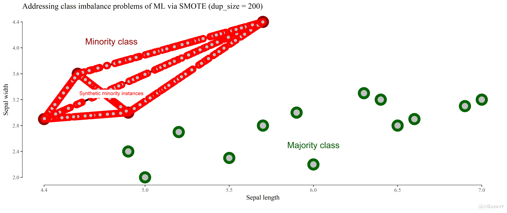

# Remedies

A lot of research have been made concerning this problem. Our goal is not to make an exhaustive review of all the technics to remedies this issue. 
In this study, we will focus on methods than we can reproduce with our level of competence. It appears to us that it is interesting to separate the chosen methods in three levels :

* First, some remedies we can use before launching the machine learning algorithm (Pre-processing).
* Secondly, some remedies we can use during the computation of a fitted models by the machine (learning method tuning).
* At last, some remedies that can be used after the machine learning algorithm (post-processing).

## Pre processing resampling 

A lot of method exists in order to balanced a sample. Since the begin of the 21th century, a lot of studies appears in order to manage and discuss about sampling. Some methods are more sophisticated than other and might give better results, but they have no consensus on a method which have better results. Globally we can say it is the most common and popular remedies to counteract imbalanced data for two key reasons : we can use the sampled datas with all classifiers and it gives generally pretty goods results.

The first "basic" try of resampling is obviously try to make random over sampling or down-sizing. Over sampling consists in duplicate randomly positive cases in order to reach two class with approximately the same number of case. Down-sizing consists at randomly remove some negative cases in order to diminish the negative classes. Then we can easily imagine other way to select the cases removed or duplicate. Moreover, we can try to mix the two methods. 
  
In her paper, Japkowicz discussed the effect of imbalance in a data set. Two resampling methods were considered. Random resampling consisted of resampling the smaller class at random until it consisted of as many samples as the majority class and “focused resampling” consisted of resampling only those minority examples that occurred on the boundary between the minority and majority classes. Random under-sampling was considered, which involved under-sampling the majority class samples at random until their numbers matched the number of minority class samples; focused under-sampling involved under-sampling the majority class samples lying further away. She noted that both the sampling approaches were effective, and she also observed that using the sophisticated sampling techniques did not give any clear advantage in the domain considered. [@Jaku]

One approach that is particularly relevant to our work is that of Ling and Li (1998). They combined over-sampling of the minority class with under-sampling of the majorityclass. [@ling]

in order to try and discuss those resampling proceeds, the part "application"  shows examples of random up and down sampling in order to make comparison with more sophisticated method as SMOTE and ROSE. 

### Random Up and Down sample : 

DownSizing will randomly sample a data set so that all classes have the same frequency as the minority class. UpSample samples with replacement to make the class distributions equal.

### ROSE

Creates a sample of synthetic  data by enlarging the features space of minority and majority class examples. Operationally, the new examples are down from a conditionnal kernel density estimate of the two classes as describe in Menardi and torelli (2013).

The ROSE strategy to deal with class imbalance ROSE [@ROSE] provides a unified framework to deal simultaneously with the two above-mentioned problems of model estimation and accuracy evaluation in imbalanced learning. It builds on the generation of new artificial examples from the classes, according to a smoothed bootstrap approach.
Consider a training set $T_n$, of size $n$, whose generic row is the pair $(x_i, y_i)$, i = 1, . . . , n. The class
labels $y_i$ belong to the set $(\gamma0, \gamma1)$, and $x_i$ are some related attributes supposed to be realizations of a random vector x defined on $R^d$, with an unknown probability density function $f (x)$. Let the number of units in class $\gamma_j, j = 0, 1,$ be denoted by $n_j < n$. The ROSE procedure for generating one new artificial
example consists of the following steps:

- 1. Select $y* = Y_j$ with probability $\pi_j$.
- 2. Select $(xi, yi) \in T_n, $such that$y_i = y*$, with probability $\frac{1}{n_j}$.
- 3. Sample $x^*$ from $K_{H_j} (.,xi)$, with $K_{H_j}$ a probability distribution centered at $xi$ and covariance matrix $Hj$.

Essentially, we draw from the training set an observation belonging to one of the two classes, and generate a new example $(x*, y*)$ in its neighborhood, where the shape of the neighborhood is determined by the shape of the contour sets of $K$ and its width is governed by $Hj$.

### Smote family (smoteNC, BLSMOTE, ADASYN)

SMOTE is a well-known algorithm to fight this problem. The general idea of this method is to artificially generate new examples of the minority class using the nearest neighbors of these cases. Furthermore, the majority class examples are also under-sampled, leading to a more balanced dataset.

The SMOTE function oversamples your rare event by using bootstrapping and k-nearest neighbor to synthetically create additional observations of that event. The definition of rare event is usually attributed to any outcome variable that happens less than 15% of the time. 

The minority class is over-sampled by taking each minority class sample and introducing synthetic examples along the line segments joining any/all of the k minority class nearest neighbors.  Depending upon the amount of over-sampling required, neighbors from the k nearest neighbors are randomly chosen.  The implementation currently uses five nearest neighbors.  For instance, if the amount of over-sampling needed is 200%, only two neighbors from the five nearest neighbors are chosen and one sample is generated in the direction of each.  Synthetic samples are generated in the following way: Take the difference between the feature vector (sample) under consideration and its nearest neighbor. Multiply this difference by a random number between 0 and 1, and add it to the feature vector under consideration.  This causes the selection of a random point along the line segment between two specific features.  This approach effectively forces the decision region of the minority class to become more general. [@chawla2002]

```{r}

```

## Learning method tuning

### Metaparameters tuning

A first try can be to handle the parameters of the classifiers used. Empirycally we'll see in part 5 "Application" that it don't give some significant results to counteract imbalanced data set predictions.

### Weighted class

We try to attribute some weights to our class but the results was not convinced. We try different ways and look for serious or significant results with this methods but it seems that it don't give results. Maybe the algorithm incorporing these results must be reshaped. 

The best try to handle with classifiers during the learning step was to incorporate a cost matrix. We choose to use it with decision tree because the algorithm CART shows good results in the literrature.[@MK]

### direct sensitive learning with cart classifer

The incorporation of benefits and/or costs (negative benefits) in existing algorithms, as a way to express the utility of different predictions, is one of the known approaches to cope with imbalanced domains.

Instead of optimizing the typical performance measure, such as accuracy or impurity, some models can alternatively optimize a cost or loss function that deferentially weights specific types of errors. 

We summarize the theory of cost-sensitive learning, published mostly in (Elkan, 2001). The theory describes how the misclassification cost plays its essential role invarious cost-sensitive learning algorithms.

A cost matrix assigns a cost to each cell in the confusion matrix.
The example below is a cost matrix where we use the notation C() to indicate the cost, the first value represented as the predicted class and the second value represents the actual class. [@elkanCS]

```{r, echo=FALSE}
mc <- matrix(c("C(1, 1) TP", "C(0, 1) FP", "C(1,0) FN", "C(0,0) TN"), nrow = 2)
dimnames(mc) <- list(c("Positive", "Negative"), c("Positive", "Negative"))
as.data.frame(mc) %>% kable() %>% kable_styling() %>% 
  pack_rows("True",1,2) %>% add_header_above(c(" " = 1 ,"Predicted" = 2))

```

We can see that the cost of a False Positive is C(1,0) and the cost of a False Negative is C(0,1).

An intuition from this matrix is that the cost of misclassification is always higher than correct classification, otherwise, cost can be minimized by predicting one class. 

Conceptually, the cost of labeling an example incorrectly should always be greater than the cost of labeling it correctly.

$$Total Cost = C(0,1) * False Negatives + C(1,0) * False Positives$$
This is the value that we seek to minimize in cost-sensitive learning, at least conceptually.

To go further, a very good paper here. [@lingCS]

## post-processing threesholding

When there are two possible outcome categories, another method for increasing the prediction accuracy of the minority class samples is to determine alternative cutoffs for the predicted probabilities

The threshold probability (kind of classification criteria): $$ P(Y=1, X=x) > 0,5$$

0.5 is a basic threshold which means that objects predicted with a probability to belong class 1 is higher than 0.5 will be classify as positive class. We can, for example, be more selective in terms of entry criteria and choose a threshold at 0,7.
There may be situations where the sensitivity/specificity trade-off can be accomplished without severely compromising the accuracy of the majority class (which, of course, depends on the context of the problem).

